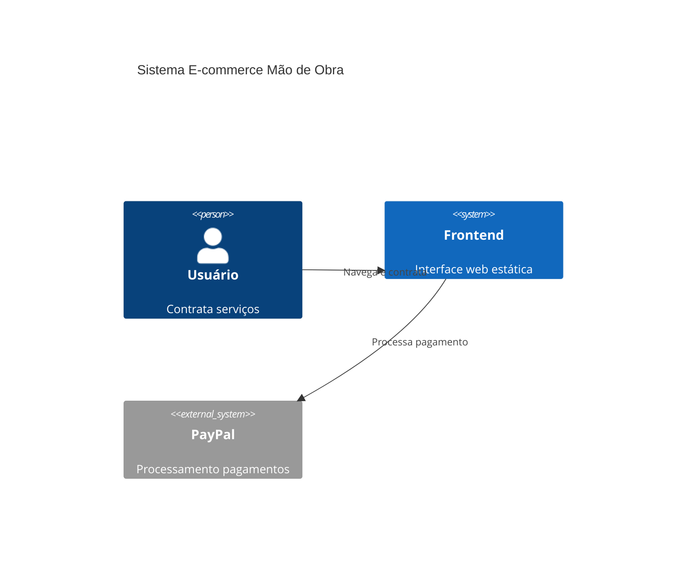

# 🚀 Estrutura Profissional do Repositório

Este PR implementa uma estrutura profissional completa para o repositório, transformando-o em um projeto de referência para desenvolvimento frontend.

## 📋 Mudanças Implementadas

### 📦 Configuração do Projeto
- ✅ **package.json** - Configuração Node.js com scripts npm para desenvolvimento, build e teste
- ✅ **Configurações de desenvolvimento** (.editorconfig, .gitignore, .gitattributes)
- ✅ **CODEOWNERS** - Definição de responsáveis pelo código

### 📚 Documentação Completa
- ✅ **README.md** atualizado (PT-BR/EN) com diagramas C4, scripts npm e roadmap
- ✅ **LICENSE** (MIT) - Licenciamento open source
- ✅ **CONTRIBUTING.md** - Guia completo de contribuição
- ✅ **CODE_OF_CONDUCT.md** - Código de conduta da comunidade
- ✅ **SECURITY.md** - Política de segurança
- ✅ **SUPPORT.md** - Canais de suporte
- ✅ **CHANGELOG.md** - Histórico de mudanças

### 🏗️ Documentação de Arquitetura
- ✅ **docs/architecture.md** - Visão geral da arquitetura com diagramas C4
- ✅ **docs/adr/0001-record-architecture.md** - Decisões arquiteturais documentadas

### 🔧 Templates do GitHub
- ✅ **Issue Templates** - Templates estruturados para bugs e feature requests
- ✅ **PR Template** - Template padrão para pull requests
- ✅ **PR Body Template** - Corpo do PR para referência futura

### ⚙️ Workflows de CI/CD
- ✅ **CI Workflow** - Pipeline com matriz Node.js (20, 22), lint, test e build
- ✅ **CodeQL Analysis** - Análise de segurança JavaScript
- ✅ **Dependabot** - Atualizações automáticas (npm + github-actions)
- ✅ **Release Drafter** - Geração automática de releases

## 🎯 Benefícios

### Para Desenvolvedores
- 🛠️ **Scripts npm padronizados** para desenvolvimento (`npm start`, `npm test`, `npm run lint`)
- 📖 **Documentação clara** sobre arquitetura e decisões técnicas
- ✅ **Templates estruturados** para issues e PRs
- 🔄 **CI/CD automatizado** com qualidade e segurança

### Para a Comunidade
- 📝 **Guias de contribuição** em português e inglês
- 🤝 **Código de conduta** estabelecido
- 🔒 **Política de segurança** clara
- 💬 **Canais de suporte** definidos

### Para Manutenção
- 🔄 **Dependabot** mantém dependências atualizadas
- 📊 **CodeQL** monitora vulnerabilidades
- 📋 **Templates** padronizam comunicação
- 📚 **ADRs** documentam decisões importantes

## 🧪 Como Testar

1. **Clone e instale**:
   ```bash
   git checkout chore/repo-polish
   npm install
   ```

2. **Teste os scripts**:
   ```bash
   npm start      # Inicia servidor local
   npm test       # Executa validações
   npm run lint   # Executa linting
   ```

3. **Verifique a documentação**:
   - Navegue pelos arquivos .md criados
   - Teste os links e referências
   - Verifique templates do GitHub

## 🎨 Arquitetura C4



## ⚡ Qualidade e Performance

- **ESLint** - Padronização de código JavaScript
- **HTML Validate** - Validação semântica HTML
- **Stylelint** - Linting para CSS
- **Lighthouse** - Métricas de performance (futuro)
- **Acessibilidade** - Práticas a11y documentadas

## 🗺️ Roadmap

### Fase 1: ✅ Estrutura Base (Este PR)
- Configuração profissional do repositório
- Documentação completa
- CI/CD básico

### Fase 2: 🔄 Melhorias Técnicas
- [ ] Testes automatizados (Jest)
- [ ] Análise de acessibilidade
- [ ] Otimização de performance
- [ ] PWA features

### Fase 3: 🚀 Funcionalidades Avançadas
- [ ] Autenticação de usuários
- [ ] Sistema de avaliações
- [ ] Chat em tempo real
- [ ] Dashboard administrativo

## 🤝 Contribuição

Este repositório agora está pronto para receber contribuições da comunidade com:
- Templates estruturados para issues
- Guia completo de contribuição
- Código de conduta estabelecido
- Processo de review automatizado

---

**Tipo**: Chore/Estrutura  
**Impacto**: Não-destrutivo  
**Linguagem**: PT-BR primeiro, EN segundo  
**Status**: Pronto para review e merge