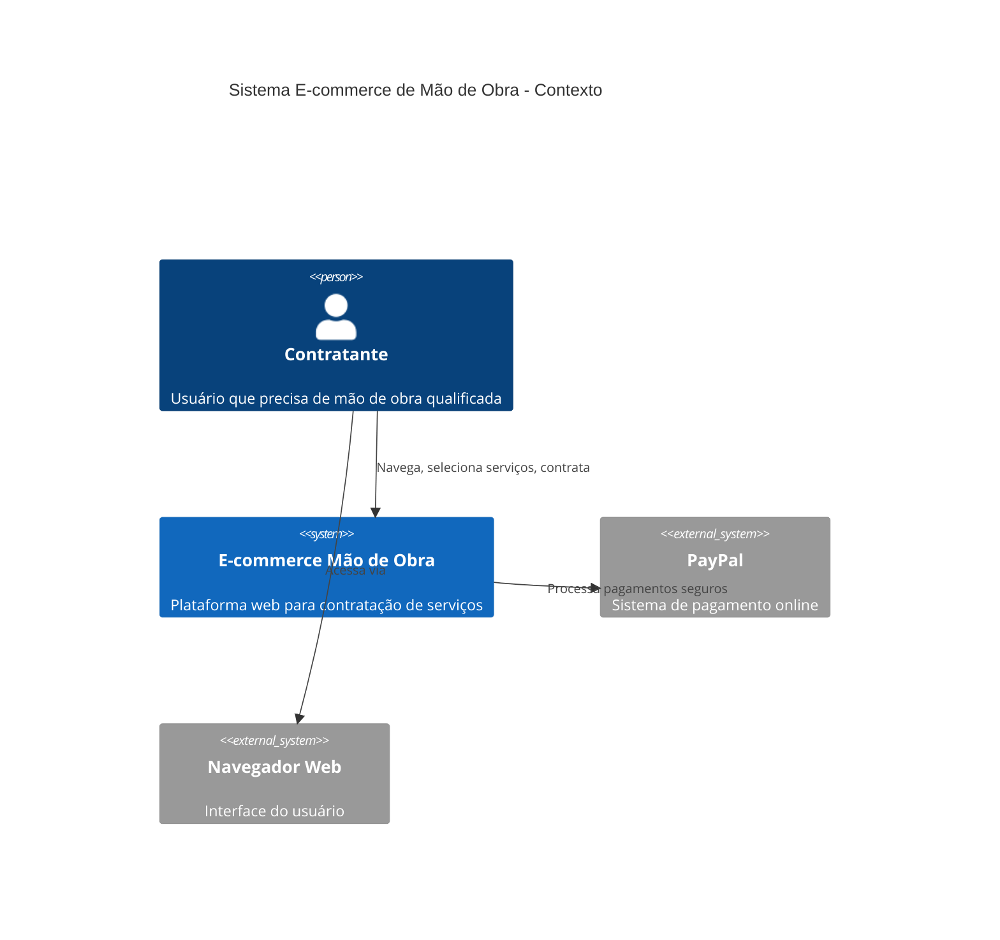
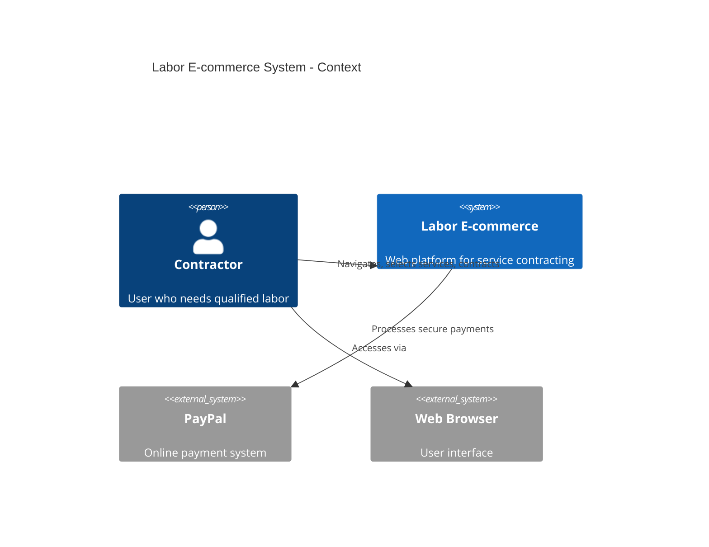

# 🛠️ E-commerce para Contratação de Mão de Obra

<div align="center">

[](https://github.com/JacksonMiranda/ecommerce-mao-de-obra/actions/workflows/ci.yml)
[](https://github.com/JacksonMiranda/ecommerce-mao-de-obra/actions/workflows/codeql.yml)
[](https://opensource.org/licenses/MIT)
[](https://nodejs.org/)

**Plataforma web moderna para conectar contratantes com profissionais qualificados**

[🇧🇷 Português](#português) | [🇺🇸 English](#english)

</div>

---

## 🇧🇷 Português

### 📖 Sobre o Projeto

Este é um e-commerce especializado em contratação de mão de obra, oferecendo uma plataforma intuitiva e segura para conectar contratantes com profissionais qualificados. O sistema integra pagamentos online via PayPal e foi desenvolvido com foco em simplicidade, performance e acessibilidade.

### 🏗️ Arquitetura do Sistema (C4 Model)



### ✨ Funcionalidades Principais

- 🎯 **Interface Intuitiva**: Design responsivo e acessível
- 👷 **Seleção de Serviços**: Mão de obra temporária ou permanente
- 💰 **Preços Transparentes**: Valores claros e competitivos
- 💳 **Pagamento Seguro**: Integração PayPal com criptografia
- 📱 **Responsivo**: Funciona em desktop, tablet e mobile
- ♿ **Acessível**: Seguindo diretrizes WCAG 2.1

### 🛠️ Tecnologias e Ferramentas

#### Frontend
- **HTML5**: Estrutura semântica e acessível
- **CSS3**: Estilização moderna e responsiva
- **JavaScript (ES6+)**: Interatividade e funcionalidades

#### Integração
- **PayPal SDK**: Pagamentos online seguros
- **HTTPS**: Protocolo seguro para transações

#### Qualidade
- **ESLint**: Padronização de código JavaScript
- **Stylelint**: Linting para CSS
- **HTML Validate**: Validação HTML semântica

### 🚀 Início Rápido

#### Pré-requisitos
- Node.js >= 18.0.0
- npm >= 8.0.0

#### Instalação

```bash
# Clone o repositório
git clone https://github.com/JacksonMiranda/ecommerce-mao-de-obra.git

# Entre no diretório
cd ecommerce-mao-de-obra

# Instale as dependências
npm install

# Inicie o servidor de desenvolvimento
npm start
```

O site estará disponível em `http://localhost:3000`

### 📜 Scripts Disponíveis

| Script | Descrição |
|--------|-----------|
| `npm start` | Inicia servidor de desenvolvimento |
| `npm run dev` | Modo desenvolvimento com CORS |
| `npm run build` | Build para produção |
| `npm test` | Executa todos os testes |
| `npm run lint` | Executa linting (JS + CSS + HTML) |
| `npm run lint:js` | Linting apenas JavaScript |
| `npm run lint:css` | Linting apenas CSS |
| `npm run lint:html` | Validação HTML |

### 📁 Estrutura do Projeto

```
ecommerce-mao-de-obra/
├── 📄 index.html              # Página principal
├── 📄 contract.html           # Página de contratação
├── 📁 css/
│   └── styles.css            # Estilos globais
├── 📁 js/
│   ├── script.js             # Scripts principais
│   └── payment.js            # Lógica de pagamento
├── 📁 img/                   # Assets de imagem
├── 📁 docs/                  # Documentação técnica
│   ├── architecture.md      # Arquitetura detalhada
│   └── adr/                 # Registros de decisão
├── 📁 .github/              # Templates e workflows
│   ├── workflows/           # CI/CD pipelines
│   └── ISSUE_TEMPLATE/      # Templates de issues
└── 📋 package.json          # Configuração do projeto
```

### 🔄 Fluxo de Uso

1. **Navegação**: Usuário acessa a página principal
2. **Exploração**: Visualiza categorias disponíveis
3. **Seleção**: Escolhe tipo de serviço desejado
4. **Contratação**: Preenche detalhes na página de contrato
5. **Pagamento**: Processa pagamento via PayPal
6. **Confirmação**: Recebe confirmação da contratação

### 🎨 Qualidade e Padrões

#### Linting e Formatação
- ✅ **ESLint** - Padrões de código JavaScript
- ✅ **Stylelint** - Padrões de CSS
- ✅ **HTML Validate** - Validação semântica
- ✅ **EditorConfig** - Consistência de formatação

#### Acessibilidade
- ♿ **ARIA Labels**: Elementos devidamente rotulados
- 🎨 **Contraste**: Cores com contraste adequado
- ⌨️ **Navegação por Teclado**: Totalmente navegável
- 📱 **Responsividade**: Adaptável a diferentes telas

### 🗺️ Roadmap

#### Versão 1.1 - Melhorias de UX
- [ ] Sistema de avaliações
- [ ] Chat em tempo real
- [ ] Notificações push
- [ ] PWA capabilities

#### Versão 1.2 - Funcionalidades Avançadas
- [ ] Autenticação de usuários
- [ ] Dashboard de contratos
- [ ] Sistema de favoritos
- [ ] Múltiplos métodos de pagamento

#### Versão 2.0 - Expansão
- [ ] App mobile nativo
- [ ] API REST
- [ ] Sistema de matchmaking
- [ ] Analytics avançado

### 🤝 Contribuindo

Valorizamos todas as contribuições! Veja nosso [Guia de Contribuição](CONTRIBUTING.md) para detalhes sobre:

- 🐛 Como reportar bugs
- 💡 Como sugerir funcionalidades
- 🔧 Como configurar ambiente de desenvolvimento
- 📝 Padrões de código e commit

### 📋 Licença

Este projeto está licenciado sob a [Licença MIT](LICENSE) - veja o arquivo para detalhes.

### 📞 Suporte

- 📧 **Email**: jackson.j.m@hotmail.com
- 💬 **Discussions**: [GitHub Discussions](https://github.com/JacksonMiranda/ecommerce-mao-de-obra/discussions)
- 🐛 **Issues**: [Reportar Problemas](https://github.com/JacksonMiranda/ecommerce-mao-de-obra/issues)
- 🔒 **Segurança**: Veja [SECURITY.md](SECURITY.md)

### 👨‍💻 Autor

**Jackson J. Miranda**
- 🌐 **LinkedIn**: [jacksonmiranda](https://www.linkedin.com/in/jacksonmiranda/)
- 📧 **Email**: jackson.j.m@hotmail.com
- 🐙 **GitHub**: [@JacksonMiranda](https://github.com/JacksonMiranda)

---

## 🇺🇸 English

### 📖 About the Project

This is an e-commerce platform specialized in labor hiring, offering an intuitive and secure platform to connect contractors with qualified professionals. The system integrates online payments via PayPal and was developed with focus on simplicity, performance, and accessibility.

### 🏗️ System Architecture (C4 Model)



### ✨ Key Features

- 🎯 **Intuitive Interface**: Responsive and accessible design
- 👷 **Service Selection**: Temporary or permanent labor
- 💰 **Transparent Pricing**: Clear and competitive rates
- 💳 **Secure Payment**: PayPal integration with encryption
- 📱 **Responsive**: Works on desktop, tablet, and mobile
- ♿ **Accessible**: Following WCAG 2.1 guidelines

### 🛠️ Technologies and Tools

#### Frontend
- **HTML5**: Semantic and accessible structure
- **CSS3**: Modern and responsive styling
- **JavaScript (ES6+)**: Interactivity and functionality

#### Integration
- **PayPal SDK**: Secure online payments
- **HTTPS**: Secure protocol for transactions

#### Quality
- **ESLint**: JavaScript code standardization
- **Stylelint**: CSS linting
- **HTML Validate**: Semantic HTML validation

### 🚀 Quick Start

#### Prerequisites
- Node.js >= 18.0.0
- npm >= 8.0.0

#### Installation

```bash
# Clone the repository
git clone https://github.com/JacksonMiranda/ecommerce-mao-de-obra.git

# Enter directory
cd ecommerce-mao-de-obra

# Install dependencies
npm install

# Start development server
npm start
```

The site will be available at `http://localhost:3000`

### 📜 Available Scripts

| Script | Description |
|--------|-------------|
| `npm start` | Start development server |
| `npm run dev` | Development mode with CORS |
| `npm run build` | Build for production |
| `npm test` | Run all tests |
| `npm run lint` | Run linting (JS + CSS + HTML) |
| `npm run lint:js` | Lint JavaScript only |
| `npm run lint:css` | Lint CSS only |
| `npm run lint:html` | Validate HTML |

### 📁 Project Structure

```
ecommerce-mao-de-obra/
├── 📄 index.html              # Main page
├── 📄 contract.html           # Contract page
├── 📁 css/
│   └── styles.css            # Global styles
├── 📁 js/
│   ├── script.js             # Main scripts
│   └── payment.js            # Payment logic
├── 📁 img/                   # Image assets
├── 📁 docs/                  # Technical documentation
│   ├── architecture.md      # Detailed architecture
│   └── adr/                 # Decision records
├── 📁 .github/              # Templates and workflows
│   ├── workflows/           # CI/CD pipelines
│   └── ISSUE_TEMPLATE/      # Issue templates
└── 📋 package.json          # Project configuration
```

### 🔄 User Flow

1. **Navigation**: User accesses main page
2. **Exploration**: Views available categories
3. **Selection**: Chooses desired service type
4. **Contracting**: Fills details on contract page
5. **Payment**: Processes payment via PayPal
6. **Confirmation**: Receives contracting confirmation

### 🎨 Quality and Standards

#### Linting and Formatting
- ✅ **ESLint** - JavaScript code standards
- ✅ **Stylelint** - CSS standards
- ✅ **HTML Validate** - Semantic validation
- ✅ **EditorConfig** - Formatting consistency

#### Accessibility
- ♿ **ARIA Labels**: Properly labeled elements
- 🎨 **Contrast**: Colors with adequate contrast
- ⌨️ **Keyboard Navigation**: Fully navigable
- 📱 **Responsiveness**: Adaptable to different screens

### 🗺️ Roadmap

#### Version 1.1 - UX Improvements
- [ ] Rating system
- [ ] Real-time chat
- [ ] Push notifications
- [ ] PWA capabilities

#### Version 1.2 - Advanced Features
- [ ] User authentication
- [ ] Contract dashboard
- [ ] Favorites system
- [ ] Multiple payment methods

#### Version 2.0 - Expansion
- [ ] Native mobile app
- [ ] REST API
- [ ] Matchmaking system
- [ ] Advanced analytics

### 🤝 Contributing

We value all contributions! See our [Contributing Guide](CONTRIBUTING.md) for details on:

- 🐛 How to report bugs
- 💡 How to suggest features
- 🔧 How to set up development environment
- 📝 Code and commit standards

### 📋 License

This project is licensed under the [MIT License](LICENSE) - see the file for details.

### 📞 Support

- 📧 **Email**: jackson.j.m@hotmail.com
- 💬 **Discussions**: [GitHub Discussions](https://github.com/JacksonMiranda/ecommerce-mao-de-obra/discussions)
- 🐛 **Issues**: [Report Problems](https://github.com/JacksonMiranda/ecommerce-mao-de-obra/issues)
- 🔒 **Security**: See [SECURITY.md](SECURITY.md)

### 👨‍💻 Author

**Jackson J. Miranda**
- 🌐 **LinkedIn**: [jacksonmiranda](https://www.linkedin.com/in/jacksonmiranda/)
- 📧 **Email**: jackson.j.m@hotmail.com
- 🐙 **GitHub**: [@JacksonMiranda](https://github.com/JacksonMiranda)
