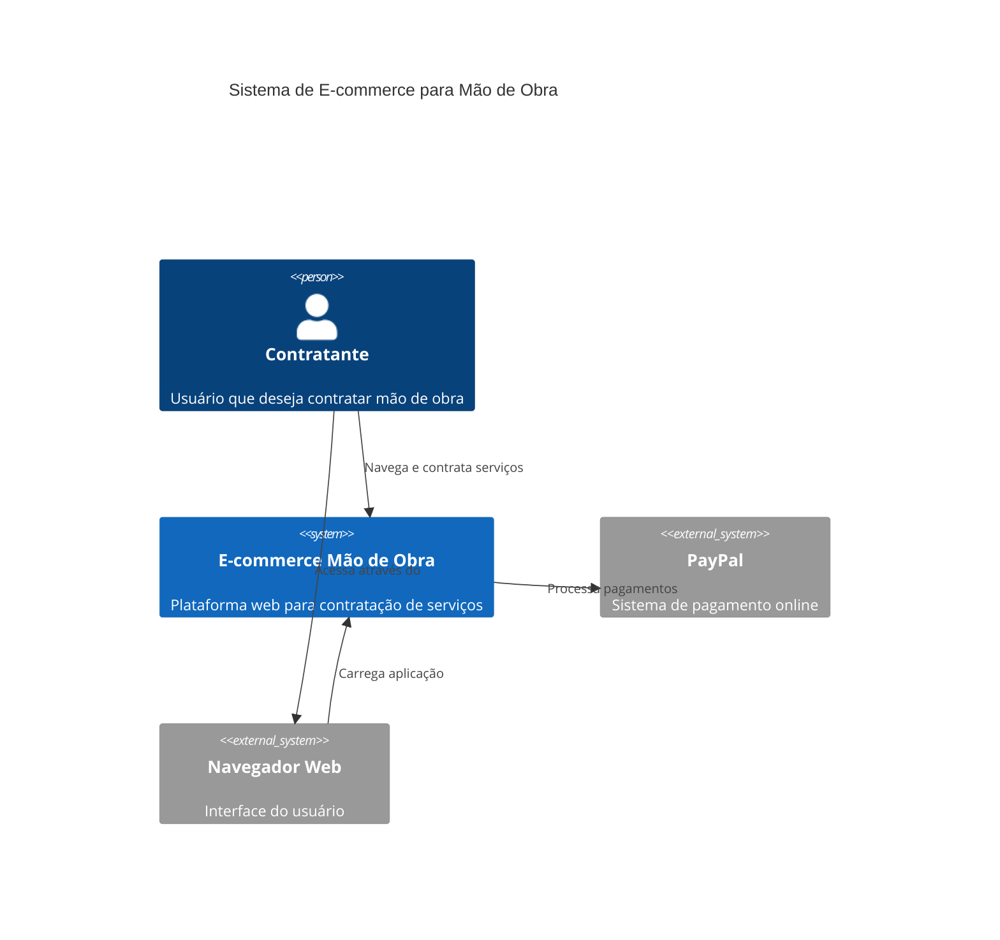
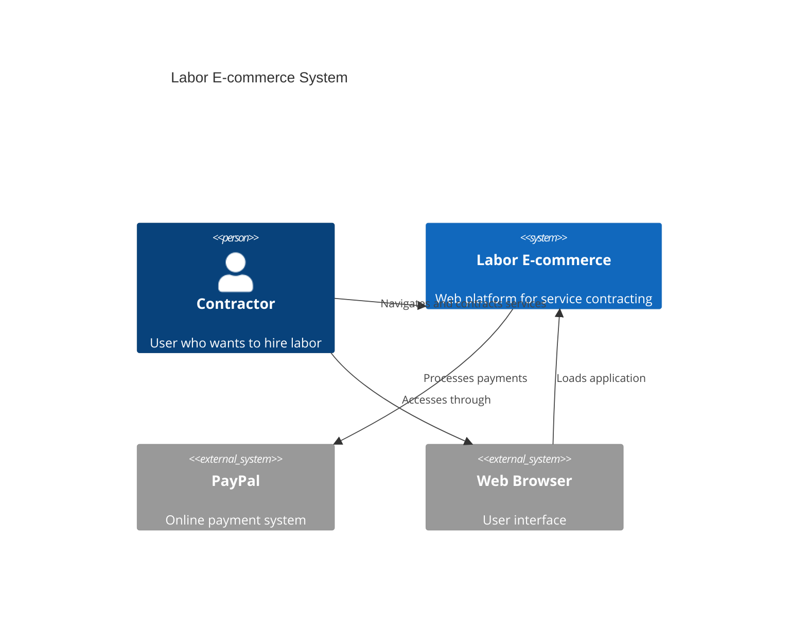

# Arquitetura do Sistema / System Architecture

[English version below](#english)

## 🇧🇷 Visão Geral

O E-commerce de Mão de Obra é uma aplicação web estática que conecta contratantes com profissionais qualificados, oferecendo um sistema integrado de pagamento online.

## Diagrama C4 - Nível 1: Contexto do Sistema



## Arquitetura Técnica

### Frontend (Camada de Apresentação)
- **Tecnologia**: HTML5, CSS3, JavaScript (ES6+)
- **Estrutura**: Single Page Application (SPA) simplificada
- **Responsividade**: Design responsivo para múltiplos dispositivos
- **Acessibilidade**: Implementação de boas práticas de a11y

### Integração de Pagamento
- **Provedor**: PayPal SDK
- **Protocolo**: HTTPS
- **Moedas**: Real Brasileiro (BRL)
- **Métodos**: Cartão de crédito via PayPal

### Estrutura de Arquivos

```
ecommerce-mao-de-obra/
├── index.html              # Página principal
├── contract.html           # Página de contratação
├── css/
│   └── styles.css         # Estilos globais
├── js/
│   ├── script.js          # Scripts principais
│   └── payment.js         # Lógica de pagamento
├── img/                   # Assets de imagem
└── docs/                  # Documentação
```

## Fluxo de Dados

1. **Navegação**: Usuário acessa index.html
2. **Seleção**: Escolhe tipo de serviço (temporário/permanente)
3. **Contratação**: Navega para contract.html
4. **Pagamento**: Integração com PayPal SDK
5. **Confirmação**: Feedback de sucesso/erro

## Princípios de Design

- **Simplicidade**: Interface intuitiva e direta
- **Performance**: Carregamento rápido com assets otimizados
- **Segurança**: Integração segura com PayPal
- **Manutenibilidade**: Código limpo e bem documentado

## Considerações de Segurança

- Uso de HTTPS em produção
- Validação de entrada no frontend
- Integração segura com PayPal SDK
- Não armazenamento de dados sensíveis

---

## 🇺🇸 English

## Overview

The Labor E-commerce is a static web application that connects contractors with qualified professionals, offering an integrated online payment system.

## C4 Diagram - Level 1: System Context



## Technical Architecture

### Frontend (Presentation Layer)
- **Technology**: HTML5, CSS3, JavaScript (ES6+)
- **Structure**: Simplified Single Page Application (SPA)
- **Responsiveness**: Responsive design for multiple devices
- **Accessibility**: Implementation of a11y best practices

### Payment Integration
- **Provider**: PayPal SDK
- **Protocol**: HTTPS
- **Currency**: Brazilian Real (BRL)
- **Methods**: Credit card via PayPal

### File Structure

```
ecommerce-mao-de-obra/
├── index.html              # Main page
├── contract.html           # Contract page
├── css/
│   └── styles.css         # Global styles
├── js/
│   ├── script.js          # Main scripts
│   └── payment.js         # Payment logic
├── img/                   # Image assets
└── docs/                  # Documentation
```

## Data Flow

1. **Navigation**: User accesses index.html
2. **Selection**: Chooses service type (temporary/permanent)
3. **Contracting**: Navigates to contract.html
4. **Payment**: PayPal SDK integration
5. **Confirmation**: Success/error feedback

## Design Principles

- **Simplicity**: Intuitive and direct interface
- **Performance**: Fast loading with optimized assets
- **Security**: Secure PayPal integration
- **Maintainability**: Clean and well-documented code

## Security Considerations

- HTTPS usage in production
- Frontend input validation
- Secure PayPal SDK integration
- No sensitive data storage